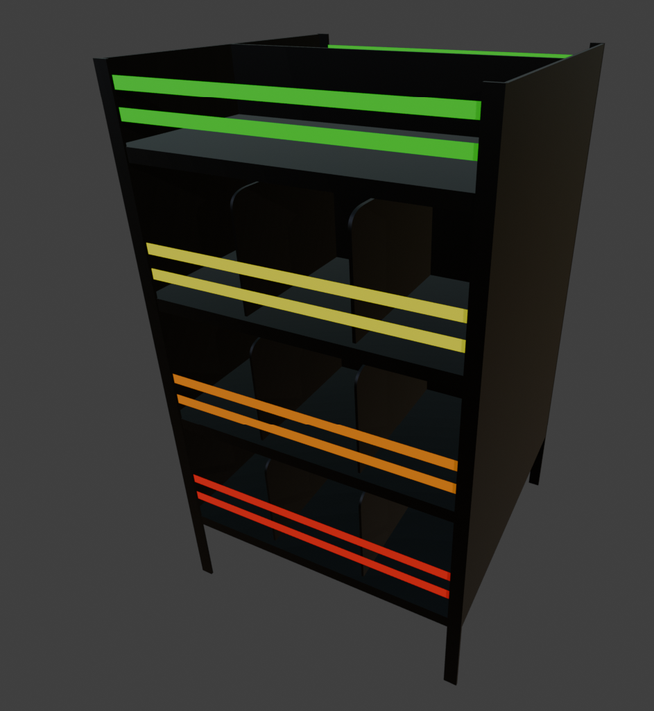

# Petrina Kinzel — Portfolio

Personal portfolio for **Petrina Kinzel**, Technical Environment Artist. Showcases
environment art and tech-art work: case studies, technical breakdowns, a showreel,
and the in-house tools built along the pipeline.

**Live site:** https://petrina-portfolio.vercel.app

<!-- Optional: add a screenshot or GIF of the home page here, e.g.

-->

## Tech stack

| Area        | Choice                                        |
| ----------- | --------------------------------------------- |
| Framework   | [Next.js 16](https://nextjs.org) (App Router) |
| Language    | TypeScript                                    |
| UI          | React 19, [shadcn/ui](https://ui.shadcn.com), Tailwind CSS v4 |
| Motion      | [Motion](https://motion.dev) (Framer Motion), GSAP |
| Graphics    | [OGL](https://github.com/oframe/ogl) (WebGL effects) |
| Icons       | lucide-react                                  |
| Deployment  | Vercel                                        |

## Getting started

Requires **Node.js 20+** (developed on Node 24).

```bash
npm install
npm run dev
```

Open [http://localhost:3000](http://localhost:3000).

## Scripts

| Command         | Description                          |
| --------------- | ------------------------------------ |
| `npm run dev`   | Start the dev server                 |
| `npm run build` | Production build                     |
| `npm run start` | Serve the production build           |
| `npm run lint`  | Run ESLint                           |

## Project structure

```
app/          Next.js App Router routes (home, case studies, AI tools, breakdowns)
components/   UI components (ui/ holds shadcn primitives)
lib/          Content/data (case studies, breakdowns, AI tools, pipeline)
public/       Static assets — images and video for projects
```

Content is data-driven: project copy and metadata live in `lib/` (e.g.
`lib/case-studies.ts`), keeping the components presentational.

## License

Source code is MIT licensed — see [../LICENSE](../LICENSE). Portfolio media and
written content are © 2026 Petrina Kinzel and are not covered by that license.
